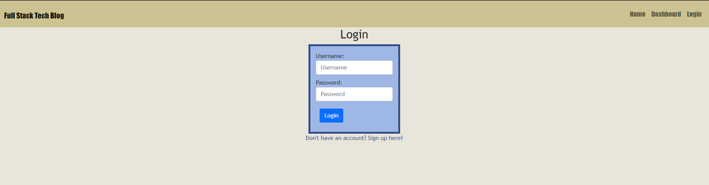
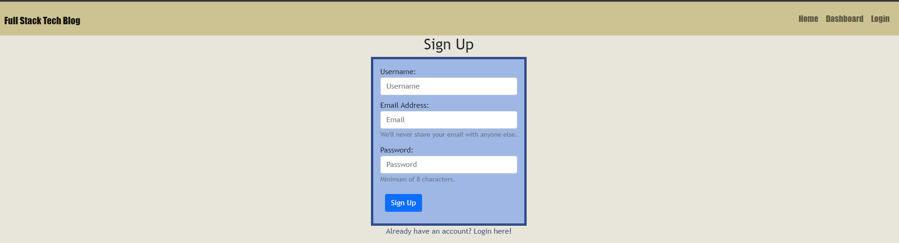
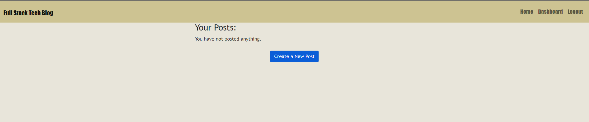
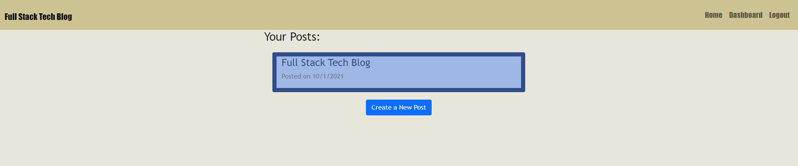
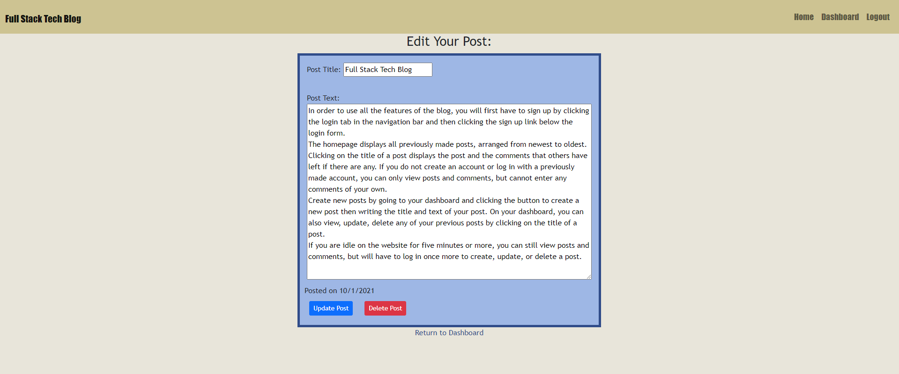
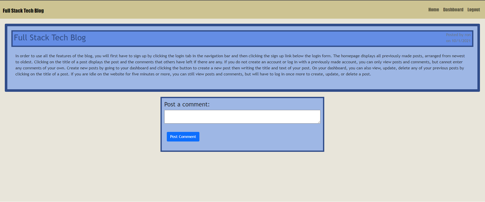

# Model View Controller Tech Blog
            
## Description
a CMS-style blog where developers can publish their blog posts and comment on other developers’s posts.

Technologies used:

- Node.js and Express.js to create a RESTful API
- Handlebars.js as the template engine
- MySQL and Sequelize ORM for the database
- Bcrypt to hash user passwords
- Dotenv to store and load environment variables

## Table of Contents
* [Usage](#usage)
* [Deployment](#deployment)
* [Screenshots](#screenshots)
* [License](#license)
* [Questions](#questions)
                    
## Usage
In order to use all the features of the blog, users have to first sign up by clicking the login tab in the navigation bar and then clicking the sign up link below the login form. Newly created user accounts are automatically logged in. Returning users can access their accounts by entering their username and password in the login page. When users create an account or log in with a previously made account, they are automatically redirected to the homepage. The homepage displays all previously made posts, arranged from newest to oldest. Clicking on the title of a post displays the post and the comments that others have left if there are any. Users that do not create an account or log in with a previously made account are allowed to view posts and comments, but cannot leave their own comments. Logged in users also have access to their dashboards where they can create new posts by clicking the button to create a new post then writing the title and text for their post. On the dashboard, users can also view, update, or delete any of their previous posts by clicking on the title of a post. If a user clicks the dashboard tab while not logged in they will be redirected to the login page. If a user is idle on the website for five minutes or more, they can still view posts and comments, but will have to log in once more to create, update, or delete a post.

## Deployment
Link to deployed app: https://full-stack-tech-blog.herokuapp.com/

## Screenshots

## License
Licensed under The MIT License

## Questions
Github: https://github.com/ronarceo

Email: ronaldmarceo@gmail.com